# Munchly:  Food Ordering Web App (Frontend)

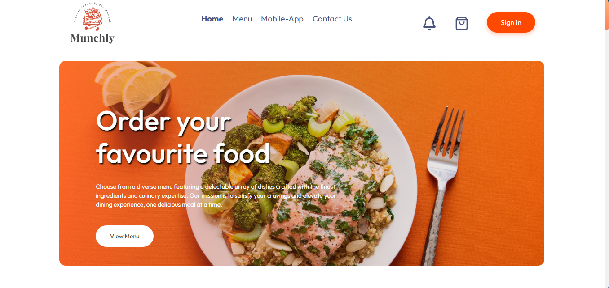

This is the frontend of a responsive food ordering web app built with React and CSS. It provides an interactive user experience with seamless navigation, a shopping cart system, and smooth animations.

<h2>🚀 Features</h2>
✅ Responsive UI built with React & CSS

✅ React Router for seamless navigation

✅ Optimized state management with useContext & useReducer

✅ Interactive cart system 🛒

✅ Engaging hamburger menu & mobile-friendly UI 📱

✅ Smooth animations & hover effects for better UX

<h2>🛠️ Tech Stack</h2> 
React (for UI components), 

React Router (for navigation), 

Context API & useReducer (for state management), 

CSS (for styling & animations)

<h2>📸 Screenshots</h2>

<h3>Sign up</h3>

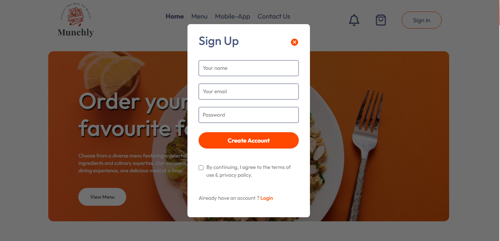

<h3>Login</h3>

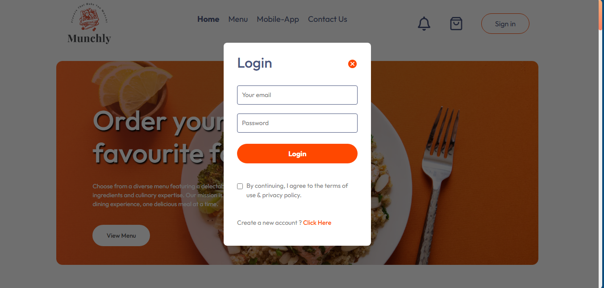

<h3>Menu</h3>

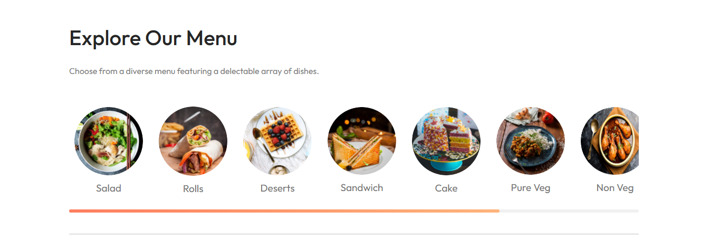

<h3>Dishes</h3>

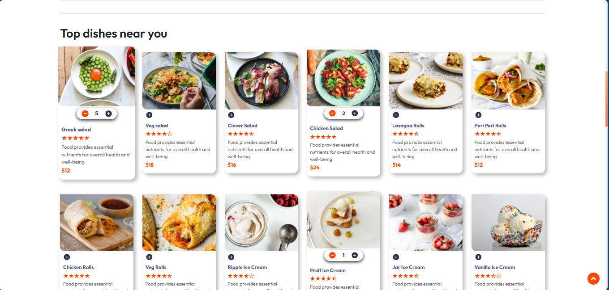

<h3>Get food as you wish</h3>

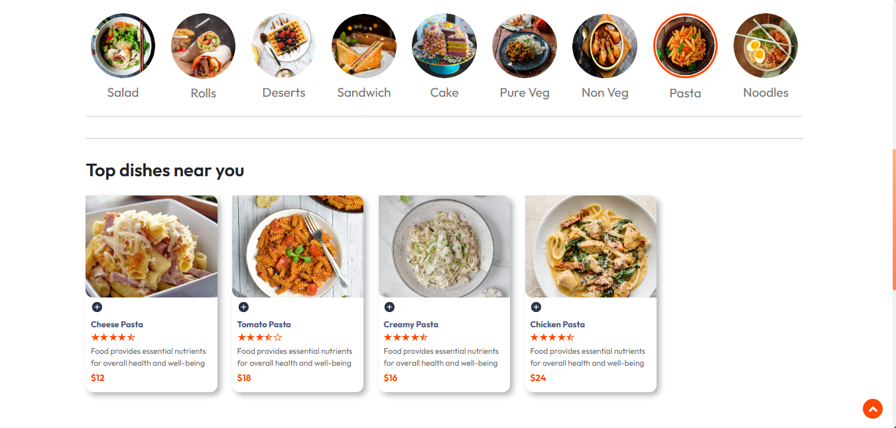

<h3>App Download and Footer section</h3>

<h3>Order page</h3>

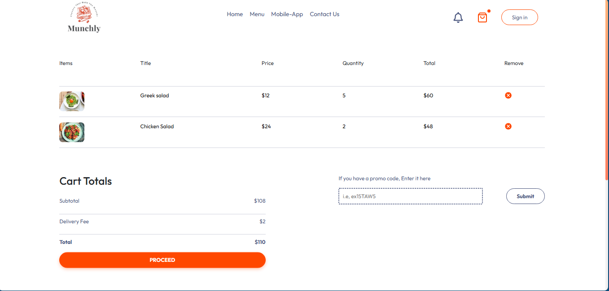

<h3>Fill Delivery Details</h3>

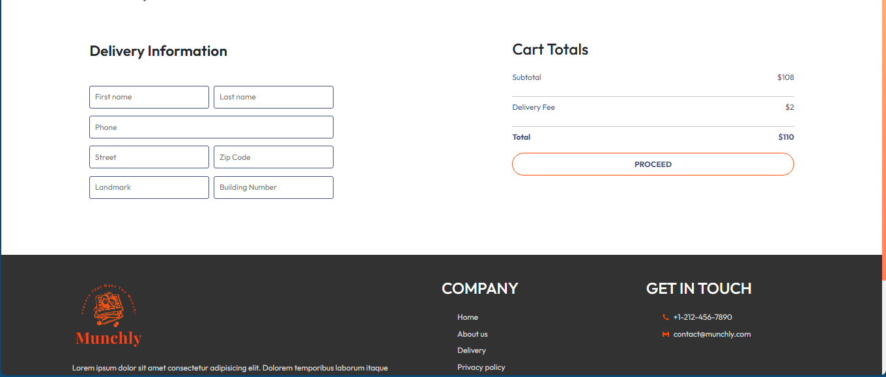

<h3>Responsiveness</h3>

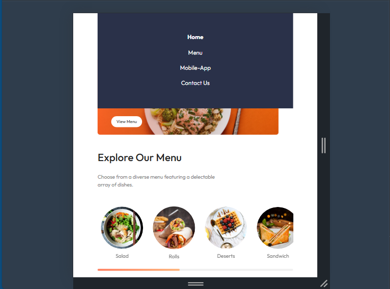
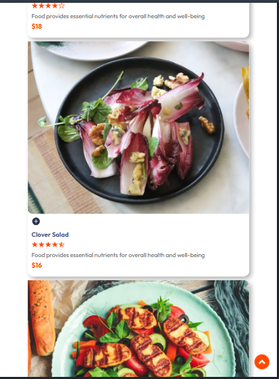
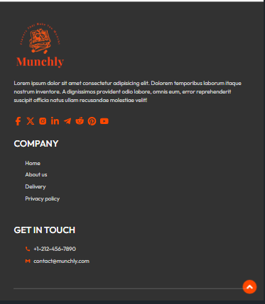

